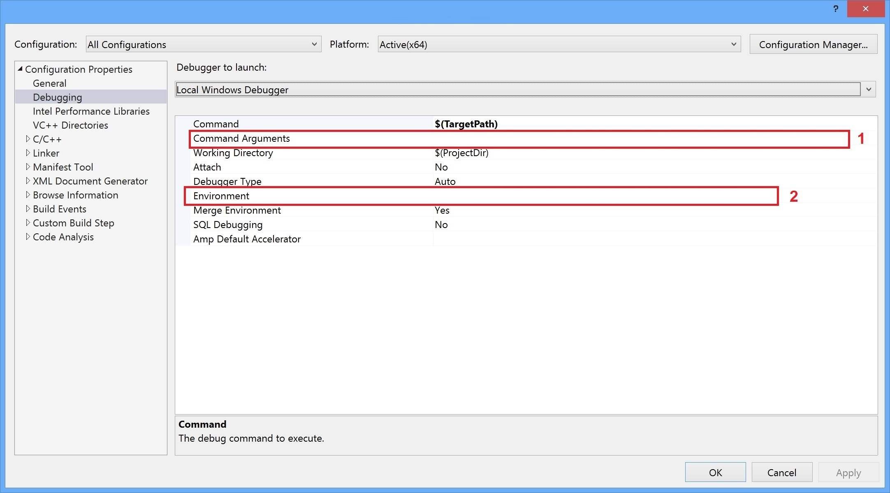

- [GPU acceleration](#gpu-acceleration)
- [Peformance numbers](#peformance-numbers)
- [Pre-built binaries](#prebuilt)
- [Building](#building)
  - [Windows](#building-windows)
  - [Generic GCC](#building-generic-gcc)
  - [Raspberry Pi (Raspbian OS)](#building-rpi)
- [Testing](#testing)
  - [Usage](#testing-usage)
  - [Examples](#testing-examples)


This application is used to check everything is ok and running as fast as expected. 
The information about the maximum frame rate could be checked using this application. 
It's open source and doesn't require registration or license key.

More information about the benchmark rules at [https://www.doubango.org/SDKs/micr/docs/Benchmark.html](https://www.doubango.org/SDKs/micr/docs/Benchmark.html).

<a name="gpu-acceleration"></a>
# GPU acceleration #
By default GPU acceleration is disabled. Check [here](../README.md#gpu-acceleration) for more information on how to enable.

<a name="peformance-numbers"></a>
# Peformance numbers #

Some performance numbers using **720p (1280x720)** images:

|  | 0.0 rate | 0.2 rate | 0.5 rate | 0.7 rate | 1.0 rate |
|-------- | --- | --- | --- | --- | --- |
| **Xeon® E31230v5, GTX 1070 (Ubuntu 18)** | 1710 millis <br/> **58.45 fps** | 2101 millis <br/> 47.57 fps | 2735 millis <br/> 36.55 fps | 3153 millis <br/> 31.71 fps | 3693 millis <br/> 27.07 fps |
| **i7-4790K (Windows 7)** | 1543 millis <br/> **64.80 fps** | 3642 millis <br/> 27.45 fps | 6919 millis <br/> 14.45 fps | 9239 millis <br/> 10.82 fps | 12392 millis <br/> 8.06 fps |
| **i7-4770HQ (Windows 10)** | 1807 millis <br/> **55.31 fps** | 5709 millis <br/> 17.51 fps | 11720 millis <br/> 8.53 fps | 15613 millis <br/> 6.40 fps | 22136 millis <br/> 4.51 fps |
| **Galaxy S10+ (Android)** | 7244 millis <br/> **13.80 fps** | 18408 millis <br/> 5.43 fps | 37880 millis <br/> 2.63 fps | 52165 millis <br/> 1.91 fps | 62776 millis <br/> 1.59 fps |
| **Raspberry Pi 4 (Raspbian Buster)** | 7477 millis <br />**13.37 fps** | 31837 millis <br/> 3.14 fps | 70229 millis <br/> 1.42 fps | 96170 millis <br/> 1.03 fps | 133263 millis <br/> 0.75 fps |

Some notes:
- **Please note that even if Raspberry Pi 4 has a 64-bit CPU [Raspbian OS](https://en.wikipedia.org/wiki/Raspbian>) uses a 32-bit kernel which means we're loosing many SIMD optimizations.**

<a name="prebuilt"></a>
# Pre-built binaries #

If you don't want to build this sample by yourself then, use the pre-built versions:
 - Windows: [benchmark.exe](../../../binaries/windows/x86_64/benchmark.exe) under [binaries/windows/x86_64](../../../binaries/windows/x86_64)
 - Linux: [benchmark](../../../binaries/linux/x86_64/benchmark) under [binaries/linux/x86_64](../../../binaries/linux/x86_64). Built on Ubuntu 18. **You'll need to download libtensorflow.so as explained [here](../README.md#gpu-acceleration-tensorflow-linux)**.
 - Raspberry Pi: [benchmark](../../../binaries/raspbian/armv7l/benchmark) under [binaries/raspbian/armv7l](../../../binaries/raspbian/armv7l)
 - Android: check [android](../../android) folder
 
On **Windows**, the easiest way to try this sample is to navigate to [binaries/windows/x86_64](../../../binaries/windows/x86_64/) and run [binaries/windows/x86_64/benchmark_cmc7.bat](../../../binaries/windows/x86_64/benchmark_cmc7.bat) or [binaries/windows/x86_64/benchmark_e13b.bat](../../../binaries/windows/x86_64/benchmark_e13b.bat). You can edit these files to use your own images and configuration options.

<a name="building"></a>
# Building #

This sample contains [a single C++ source file](benchmark.cxx) and is easy to build. The documentation about the C++ API is at [https://www.doubango.org/SDKs/micr/docs/cpp-api.html](https://www.doubango.org/SDKs/micr/docs/cpp-api.html).

<a name="building-windows"></a>
## Windows ##
You'll need Visual Studio to build the code. The VS project is at [benchmark.vcxproj](benchmark.vcxproj). Open it.
 1. You will need to change the **"Command Arguments"** like the [below image](../../../VC++_config.jpg). Default value: `--loops 100 --rate 0.2 --positive $(ProjectDir)..\..\..\assets\images\e13b_1280x720.jpg --negative $(ProjectDir)..\..\..\assets\images\traffic_1280x720.jpg --assets $(ProjectDir)..\..\..\assets`
 2. You will need to change the **"Environment"** variable like the [below image](../../../VC++_config.jpg). Default value: `PATH=$(VCRedistPaths)%PATH%;$(ProjectDir)..\..\..\binaries\windows\x86_64`
 

 
You're now ready to build and run the sample.

<a name="building-generic-gcc"></a>
## Generic GCC ##
Next command is a generic GCC command:
```
cd ultimateMICR-SDK/samples/c++/benchmark

g++ benchmark.cxx -O3 -I../../../c++ -L../../../binaries/<yourOS>/<yourArch> -lultimate_micr-sdk -o benchmark
```
- You've to change `yourOS` and  `yourArch` with the correct values. For example, on **Linux x86_64** they would be equal to `linux` and `x86_64` respectively.
- If you're cross compiling then, you'll have to change `g++` with the correct triplet. For example, on **Android ARM64** the triplet would be equal to `aarch64-linux-android-g++`.

<a name="building-rpi"></a>
## Raspberry Pi (Raspbian OS) ##

To build the sample for Raspberry Pi you can either do it on the device itself or cross compile it on [Windows](../README.md#cross-compilation-rpi-install-windows), [Linux](../README.md#cross-compilation-rpi-install-ubuntu) or OSX machines. 
For more information on how to install the toolchain for cross compilation please check [here](../README.md#cross-compilation-rpi).

```
cd ultimateMICR-SDK/samples/c++/benchmark

arm-linux-gnueabihf-g++ benchmark.cxx -O3 -I../../../c++ -L../../../binaries/raspbian/armv7l -lultimate_micr-sdk -o benchmark
```
- On Windows: replace `arm-linux-gnueabihf-g++` with `arm-linux-gnueabihf-g++.exe`
- If you're building on the device itself: replace `arm-linux-gnueabihf-g++` with `g++` to use the default GCC

<a name="testing"></a>
# Testing #
After [building](#building) the application you can test it on your local machine.

<a name="testing-usage"></a>
## Usage ##

Benchmark is a command line application with the following usage:
```
benchmark \
      --positive <path-to-image-with-micr-lines> \
      --negative <path-to-image-without-micr-lines> \
      [--assets <path-to-assets-folder>] \
      [--format <format-for-dtection:e13b/cmc7/e13b+cmc7>] \
      [--loops <number-of-times-to-run-the-loop:[1, inf]>] \
      [--rate <positive-rate:[0.0, 1.0]>] \
      [--tokenfile <path-to-license-token-file>] \
      [--tokendata <base64-license-token-data>]
```
Options surrounded with **[]** are optional.
- `--positive` Path to an image (JPEG/PNG/BMP) with MICR lines. This image will be used to evaluate the recognizer. You can use default image at [../../../assets/images/e13b_1280x720.jpg](../../../assets/images/e13b_1280x720.jpg).
- `--negative` Path to an image (JPEG/PNG/BMP) without MICR lines. This image will be used to evaluate the decoder. You can use default image at [../../../assets/images/traffic_1280x720.jpg](../../../assets/images/traffic_1280x720.jpg).
- `--assets` Path to the [assets](../../../assets) folder containing the configuration files and models. Default value is the current folder.
- `--format` Defines the MICR format to enable for the detection. Use `e13b` to look for E-13B lines only and `cmc7` for CMC-7 lines only. To look for both, use `e13b+cmc7`. For performance reasons you should not use `e13b+cmc7` unless you really expect the document to contain both E-13B and CMC7 lines. Default: `e13b+cmc7`
- `--loops` Number of times to run the processing pipeline.
- `--rate` Percentage value within [0.0, 1.0] defining the positive rate. The positive rate defines the percentage of images with MICR lines.
- `--tokenfile` Path to the file containing the base64 license token if you have one. If not provided then, the application will act like a trial version. Default: *null*.
- `--tokendata` Base64 license token if you have one. If not provided then, the application will act like a trial version. Default: *null*.

The information about the maximum frame rate is obtained using `--rate 0.0` which means evaluating the negative (no MICR lines) image only. The minimum frame rate could be obtained using `--rate 1.0` which means evaluating the positive image only (all images on the video stream have a MICR lines). In real life, very few frames from a video stream will contain a MICR lines (`--rate` **< 0.01**).

<a name="testing-examples"></a>
## Examples ##

For example, on **Raspberry Pi** you may call the benchmark application using the following command:
```
LD_LIBRARY_PATH=../../../binaries/raspbian/armv7l:$LD_LIBRARY_PATH ./benchmark \
    --positive ../../../assets/images/cmc7_1280x720.jpg \
    --negative ../../../assets/images/traffic_1280x720.jpg \
    --assets ../../../assets \
    --formay e13b+cmc7 \
    --loops 100 \
    --rate 0.2
```
On **Linux x86_64**, you may use the next command:
```
LD_LIBRARY_PATH=../../../binaries/linux/x86_64:$LD_LIBRARY_PATH ./benchmark \
    --positive ../../../assets/images/e13b_1280x720.jpg \
    --negative ../../../assets/images/traffic_1280x720.jpg \
    --assets ../../../assets \
    --formay e13b+cmc7 \
    --loops 100 \
    --rate 0.2
```
On **Windows x86_64**, you may use the next command:
```
benchmark.exe ^
    --positive ../../../assets/images/e13b_1280x720.jpg ^
    --negative ../../../assets/images/traffic_1280x720.jpg ^
    --assets ../../../assets ^
    --format e13b+cmc7 ^
    --loops 100 ^
    --rate 0.2
```

Please note that if you're cross compiling the application then you've to make sure to copy the application and both the [assets](../../../assets) and [binaries](../../../binaries) folders to the target device.


