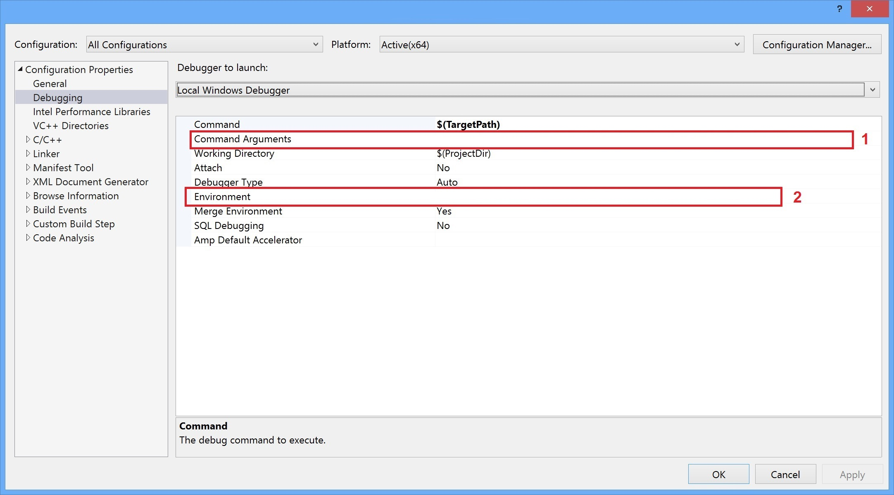

- [GPU acceleration](#gpu-acceleration)
- [Pre-built binaries](#prebuilt)
- [Building](#building)
  - [Windows](#building-windows)
  - [Generic GCC](#building-generic-gcc)
  - [Raspberry Pi (Raspbian OS)](#building-rpi)
- [Testing](#testing)
  - [Usage](#testing-usage)
  - [Examples](#testing-examples)
  - [Amazon Web Services (AWS) and Microsoft Azure](#testing-aws-azure)


This application is used as reference code for developers to show how to use the [C++ API](https://www.doubango.org/SDKs/micr/docs/cpp-api.html) to
generate a runtime key. Once a runtime key is generated it must be [activated to produce a token](https://www.doubango.org/SDKs/LicenseManager/docs/Activation_use_cases.html).

<a name="gpu-acceleration"></a>
# GPU acceleration #
By default GPU acceleration is disabled. Check [here](../README.md#gpu-acceleration) for more information on how to enable.

<a name="prebuilt"></a>
# Pre-built binaries #

If you don't want to build this sample by yourself then, use the pre-built versions:
 - Windows: [runtimeKey.exe](../../../binaries/windows/x86_64/runtimeKey.exe) under [binaries/windows/x86_64](../../../binaries/windows/x86_64)
 - Linux: [runtimeKey](../../../binaries/linux/x86_64/runtimeKey) under [binaries/linux/x86_64](../../../binaries/linux/x86_64). Built on Ubuntu 18. **You'll need to download libtensorflow.so as explained [here](../README.md#gpu-acceleration-tensorflow-linux)**.
 - Raspberry Pi: [runtimeKey](../../../binaries/raspbian/armv7l/runtimeKey) under [binaries/raspbian/armv7l](../../../binaries/raspbian/armv7l)
 - Android: check [android](../../android) folder
 
On **Windows**, the easiest way to try this sample is to navigate to [binaries/windows/x86_64](../../../binaries/windows/x86_64/) and run [binaries/windows/x86_64/runtimeKey.bat](../../../binaries/windows/x86_64/runtimeKey.bat).

<a name="building"></a>
# Building #

This sample contains [a single C++ source file](runtimeKey.cxx) and is easy to build. The documentation about the C++ API is at [https://www.doubango.org/SDKs/micr/docs/cpp-api.html](https://www.doubango.org/SDKs/micr/docs/cpp-api.html).

<a name="building-windows"></a>
## Windows ##
You'll need Visual Studio to build the code. The VS project is at [runtimeKey.vcxproj](runtimeKey.vcxproj). Open it.
 1. You will need to change the **"Command Arguments"** like the [below image](../../../VC++_config.jpg). Default value: `--assets $(ProjectDir)..\..\..\assets`
 2. You will need to change the **"Environment"** variable like the [below image](../../../VC++_config.jpg). Default value: `PATH=$(VCRedistPaths)%PATH%;$(ProjectDir)..\..\..\binaries\windows\x86_64`
 

 
You're now ready to build and run the sample.

<a name="building-generic-gcc"></a>
## Generic GCC ##
Next command is a generic GCC command:
```
cd ultimateMICR-SDK/samples/c++/runtimeKey

g++ runtimeKey.cxx -O3 -I../../../c++ -L../../../binaries/<yourOS>/<yourArch> -lultimate_micr-sdk -o runtimeKey
```
- You've to change `yourOS` and  `yourArch` with the correct values. For example, on **Linux x86_64** they would be equal to `linux` and `x86_64` respectively.
- If you're cross compiling then, you'll have to change `g++` with the correct triplet. For example, on Android ARM64 the triplet would be equal to `aarch64-linux-android-g++`.

<a name="building-rpi"></a>
## Raspberry Pi (Raspbian OS) ##

To build the sample for Raspberry Pi you can either do it on the device itself or cross compile it on [Windows](../README.md#cross-compilation-rpi-install-windows), [Linux](../README.md#cross-compilation-rpi-install-ubuntu) or OSX machines. 
For more information on how to install the toolchain for cross compilation please check [here](../README.md#cross-compilation-rpi).

```
cd ultimateMICR-SDK/samples/c++/runtimeKey

arm-linux-gnueabihf-g++ runtimeKey.cxx -O3 -I../../../c++ -L../../../binaries/raspbian/armv7l -lultimate_micr-sdk -o runtimeKey
```
- On Windows: replace `arm-linux-gnueabihf-g++` with `arm-linux-gnueabihf-g++.exe`
- If you're building on the device itself: replace `arm-linux-gnueabihf-g++` with `g++` to use the default GCC

<a name="testing"></a>
# Testing #
After [building](#building) the application you can test it on your local machine.

<a name="testing-usage"></a>
## Usage ##

runtimeKey is a command line application with the following usage:
```
runtimeKey \
      [--json <json-output:bool>] \
      [--assets <path-to-assets-folder>] \
      [--type <host-type>]
```
Options surrounded with **[]** are optional.
- `--json` Whether to output the runtime license key as JSON string intead of raw string. Default: *true*.
- `--assets` Path to the [assets](../../../assets) folder containing the configuration files and models. Default value is the current folder.
- `--type` Defines how the license is attached to the machine/host. Possible values are *aws-instance*, *aws-byol*, *azure-instance* or *azure-byol*. Default: null. More info [here](../../../AWS.md).

<a name="testing-examples"></a>
## Examples ##

For example, on **Raspberry Pi** you may call the runtimeKey application using the following command:
```
LD_LIBRARY_PATH=../../../binaries/raspbian/armv7l:$LD_LIBRARY_PATH ./runtimeKey \
    --json false \
    --assets ../../../assets
```
On **Linux x86_64** you may use the next command:
```
LD_LIBRARY_PATH=../../../binaries/linux/x86_64:$LD_LIBRARY_PATH ./runtimeKey \
    --json false \
    --assets ../../../assets
```
On **Windows x86_64**, you may use the next command:
```
runtimeKey.exe ^
    --json false ^
    --assets ../../../assets
```

Please note that if you're cross compiling the application then you've to make sure to copy the application and both the [assets](../../../assets) and [binaries](../../../binaries) folders to the target device.

<a name="testing-aws-azure"></a>
## Amazon Web Services (AWS) and Microsoft Azure ##

Please read [this](../../../AWS.md) if you're planning to run the SDK on [Amazon AWS](https://aws.amazon.com/) or [Microsoft Azure](https://azure.microsoft.com/en-us/). 

